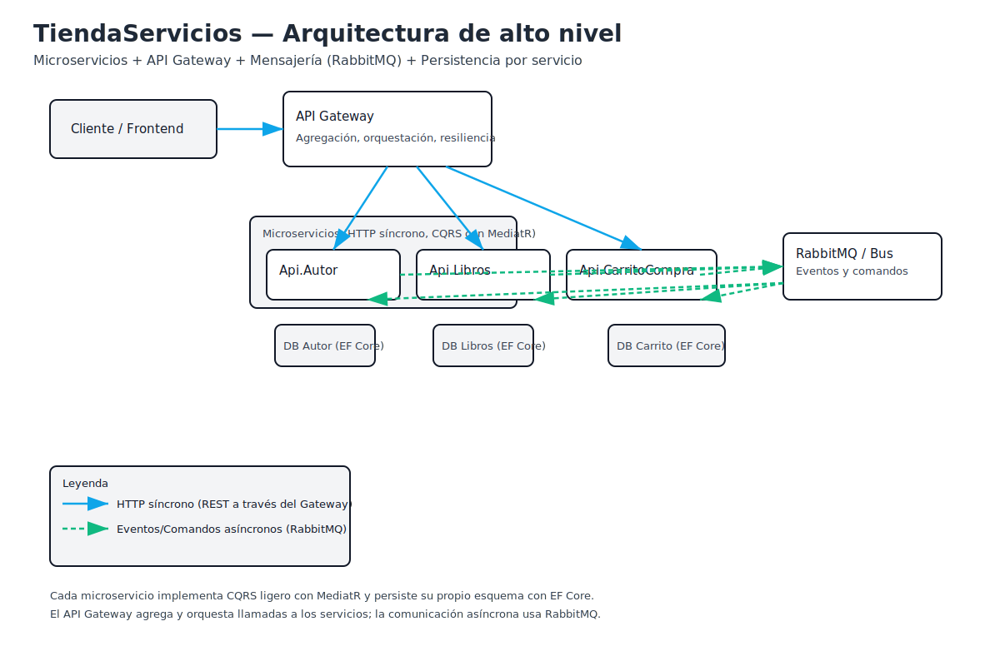

# TiendaServicios

Aplicación de ejemplo basada en microservicios para gestionar autores, libros y carritos de compra. Incluye un API Gateway, mensajería con RabbitMQ y persistencia con Entity Framework Core. A continuación encontrarás un resumen funcional, la arquitectura y mejoras sugeridas.

## Resumen de la app
- Dominio: tienda/marketplace de libros.
- Microservicios principales:
  - Api.Autor: CRUD de autores.
  - Api.Libros: CRUD de libros y su relación con autores.
  - Api.CarritoCompra: gestión de carritos de compra y sus productos.
- API Gateway: orquesta y agrega datos de múltiples microservicios para el cliente.
- Mensajería: librería compartida TiendaServicios.RabbitMQ.Bus para publicar/escuchar eventos y comandos.
- Persistencia: EF Core por servicio (tablas por bounded context). Migraciones en cada servicio.
- Infraestructura: docker-compose para levantar dependencias (p.ej., RabbitMQ), proyectos .NET 6/7.

## Arquitectura
- Estilo: Microservicios con comunicación síncrona (HTTP) vía Gateway y asíncrona (eventos) con RabbitMQ.
- Patrón CQRS con MediatR en los servicios (Handlers para comandos/consultas). Ejemplo: Nuevo.cs crea entidades y persiste con EF Core.
- Bounded contexts separados: Autor, Libros, CarritoCompra, cada uno con su propio DbContext y migraciones.
- API Gateway (TiendaServicios.Api.Gateway):
  - Expone endpoints compuestos.
  - Llama a servicios remotos (Interfaces/ImplementRemote y MessageHandler).
- Librería de integración: TiendaServicios.RabbitMQ.Bus (BusRabbit, Implement) para publicar/consumir mensajes.

### Flujo típico
1) Cliente llama a API Gateway.
2) Gateway consulta a Libros y/o Autor para enriquecer datos (o delega para escritura).
3) Operaciones de escritura dentro de cada microservicio usan MediatR (Comando -> Handler -> EF Core).
4) Eventos de dominio pueden publicarse en RabbitMQ para desacoplar procesos (p.ej., notificaciones, sincronizaciones).

### Solución y proyectos
- TiendaServicios.Api.Autor
  - Controllers, Aplicacion (Handlers), Modelo, Persistencia, Migrations.
- TiendaServicios.Api.Libros
  - Controllers, Aplicacion (Handlers), Modelo, Persistencia, Migrations.
- TiendaServicios.Api.CarritoCompra
  - Controllers, Aplicacion (Handlers), Modelo, Persistencia, RemoteInterface/RemoteService para integración.
- TiendaServicios.Api.Gateway
  - InterfaceRemote, ImplementRemote, LibroRemote, MessageHandler.
- TiendaServicios.RabbitMQ.Bus
  - BusRabbit, Comandos, Eventos, Implement.

## Tecnologías clave
- .NET 6/7, ASP.NET Core Web API.
- EF Core (migraciones por servicio).
- MediatR (CQRS ligero dentro de cada microservicio).
- RabbitMQ (mensajería asíncrona) y librería Bus propia.
- Docker Compose (orquestación local), Swagger (esperable en cada API), Polly (recomendado para resiliencia).

## Ejecución local
- Requisitos: .NET SDK 7.x, Docker Desktop.
- Opción A: Ejecutar dependencias con docker-compose y levantar APIs desde Rider/VS:
  1. docker-compose up -d
  2. Iniciar los proyectos: Api.Autor, Api.Libros, Api.CarritoCompra, Api.Gateway.
- Opción B: Ejecutar todo desde IDE seleccionando múltiples proyectos de inicio.
- Variables de entorno y connection strings: revisar launchSettings.json de cada servicio y appsettings.*.

## Puntos de entrada (ejemplos esperados)
- GET/POST /api/Autor
- GET/POST /api/Libro(s)
- POST /api/Carrito
- Endpoints agregados vía Gateway (p.ej., obtener libro con datos de autor).

## Calidad y pruebas
- Se recomienda pruebas unitarias en Handlers de MediatR (Aplicacion/*). 
- Pruebas de integración por servicio con WebApplicationFactory y DB en memoria/contenedor.
- Contratos del Gateway con pruebas de contrato (Pact) o snapshots.

## Mejores prácticas e ideas de mejora
1) Observabilidad
   - Añadir OpenTelemetry (tracing + metrics), logs estructurados (Serilog), correlación de requests.
   - Health checks por servicio y UI de health (AspNetCore.HealthChecks.UI).
2) Resiliencia y comunicación
   - Usar Polly (reintentos, circuit breaker, timeout) en llamadas HTTP del Gateway a servicios.
   - Idempotencia en comandos (clave de idempotencia para POST) y Outbox Pattern para eventos con garantía de entrega.
3) Consistencia y mensajería
   - Aplicar patrón Outbox + procesador (BackgroundService) para publicar a RabbitMQ de forma transaccional.
   - Definir contratos de eventos versionados (schema registry o convención clara) y DLQ.
4) Seguridad
   - Autenticación y autorización (JWT/OAuth2) en Gateway y propagación de identidad a servicios.
   - Validación de entrada con FluentValidation y filtros para errores unificados.
5) DX y mantenibilidad
   - Homogeneizar versiones de .NET (migrar todo a net8 si es posible) y paquetes.
   - Estándares de respuesta (RFC 7807 problem+json), paginación, ordenamiento, filtrado.
   - Swagger/OpenAPI en todos los servicios y un portal agregado en el Gateway.
6) Datos y rendimiento
   - Caching distribuido (Redis) en consultas de Libros/Autores y en el Gateway.
   - Índices adecuados y migraciones automatizadas. Revisión de N+1 y consultas proyectadas (Select).  
7) CI/CD
   - Pipeline con build, test, análisis estático (Sonar), imágenes Docker por servicio y despliegue.
   - Escenarios de despliegue: Kubernetes con Helm/Manifest + readiness/liveness probes.
8) Infra y configuración
   - Centralizar configuración (Azure App Configuration/Consul) y gestión de secretos (KeyVault/Secrets).
   - Feature flags para activar comportamientos en caliente.
9) Documentación
   - Diagramas de arquitectura (C4) y README por servicio con endpoints y ejemplo de payloads.

## Roadmap sugerido
- Fase 1: Observabilidad básica, Swagger completo, health checks, validaciones y errores uniformes.
- Fase 2: Resiliencia en Gateway (Polly), autenticación JWT, caching selectivo.
- Fase 3: Outbox + consumidores formales en RabbitMQ, contratos de eventos versionados.
- Fase 4: CI/CD e infraestructura (K8s), centralización de configuración y secrets.

---
Este README es un resumen de alto nivel. Para entender casos concretos, revisa los Handlers en cada carpeta Aplicacion (p.ej., Nuevo.cs en CarritoCompra) y los Controllers correspondientes.

## Diagrama de arquitectura
A continuación tienes un diagrama de alto nivel de la solución. Puedes abrir el archivo SVG directamente en tu navegador o IDE, y si lo necesitas, imprimirlo/convertirlo a PDF.

- Archivo (imagen SVG): `docs/architecture-diagram.svg`
- Cómo abrirlo:
  - Doble clic desde el Explorador de archivos (se abre en el navegador).
  - En Rider/VS/VS Code: ábrelo desde el árbol del proyecto.
- Cómo obtener un PDF:
  - Abre el SVG en el navegador y usa Imprimir > Guardar como PDF.
  - O bien, usa Inkscape: Archivo > Guardar como > PDF.

## Cumplimiento de código limpio (mínimo aplicado en esta sesión)
- Handlers de creación (Nuevo.cs) en Autor, Libros y CarritoCompra actualizados para:
  - Usar CancellationToken en SaveChangesAsync para cooperar con cancelación. 
  - Mejorar nombres de variables (saveResult) y mensajes de error (ortografía y claridad).
  - Validaciones de entrada con guard clauses (null/empty) donde faltaban.
  - Fechas en UTC (DateTime.UtcNow) para consistencia temporal.
- Resultado: código más legible, predecible y robusto, alineado con prácticas básicas de Clean Code.

Siguientes pasos recomendados (no intrusivos):
- Agregar .editorconfig y habilitar Microsoft.CodeAnalysis.NetAnalyzers con severidades acordadas.
- Habilitar Nullable en los proyectos y ajustar progresivamente los warnings.
- Introducir FluentValidation sistemáticamente en todos los comandos/consultas y respuesta de errores uniforme (RFC 7807).

---

## Cómo publicar este proyecto en GitHub

1) Crear el repositorio en GitHub
- Ve a https://github.com/new y crea un repo vacío llamado, por ejemplo, "TiendaServiciosMicroservicios".
- Selecciona visibilidad (público/privado) y NO inicialices con README/License (ya existen aquí).

2) Inicializar git local (si aún no se hizo) y conectar el remoto
- Abre PowerShell en la raíz del proyecto (esta carpeta).
- Ejecuta:
  - git init
  - git branch -M main
  - git add .
  - git commit -m "chore: initial import"
  - git remote add origin https://github.com/USUARIO/TiendaServiciosMicroservicios.git
  - git push -u origin main

3) Habilitar CI de GitHub Actions (opcional recomendado)
- Este repo incluye un workflow en .github/workflows/dotnet-ci.yml que compila la solución en Windows y Ubuntu.
- Tras el primer push a main, ve a la pestaña Actions en GitHub para ver la ejecución.

4) Licencia y contribuciones
- La licencia MIT está incluida en LICENSE. Cambia el nombre del titular si es necesario.
- Pautas de contribución en CONTRIBUTING.md.

5) Badge del pipeline (opcional)
- Cuando el repo esté en GitHub, puedes añadir un badge como este al inicio del README (reemplaza USUARIO y REPO):
  
